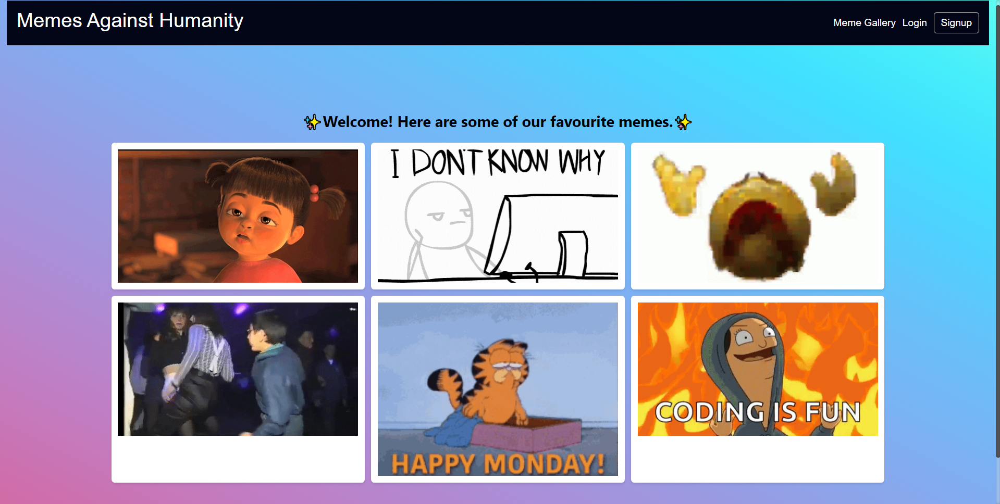
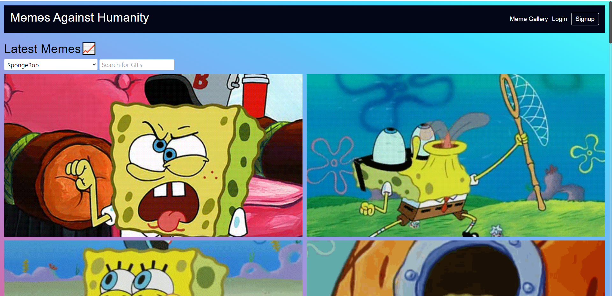

# Memes Against Humanity

## BADGES/License🔖

---

## Description 📖

---

> Our meme generator app is a fun and intuitive platform that lets you discover and collect the latest and greatest memes from Giphy. Simply search for the type of meme you're looking for, browse through the results, and click to save your favorites to your profile.

## Deployment Link ✔️

[Test it on Heroku!](https://memes-against-humanity.herokuapp.com/)

## Installation ⚙️

- Click the Green Code button above, and clone the repo.
- After cloning, type npm install on the root folder. this will install the client side and server side dependencies
- (in VSC) open terminal, type `npm run develop` this will automatically open the react app.
- enjoy!

## Usage 💻

---

TECHNOLOGIES USED

- MERN STACK (Mongo, express, React, Node)
- Giphy SDK
- CANVAS GIF\*

## Roadmap

- [x] MemeGallery is Working
- [x] Saving and Deleting Profile Memes
- [ ] ADDING interactivity between users with `like, comment, Favourite` functionality
- [ ] add game section for a game like `cards against humanity` except with memes and/or `know what i meme?`

## GIFS and Images 🖼️

---

## Images

## Gifs

## Contributions & Credits 🧑‍🤝‍🧑

---

> Credits to Ricky Nguyen, Exequiel Francia, and Michael Frayne

## Contact us 📇

---

- [My Github](https://github.com/moonphase13)

### My Partners

- [Ricky Nguyen's Github](https://github.com/akaydia)
- [Exequiel Francia's Github](https://github.com/Tweakiel)
